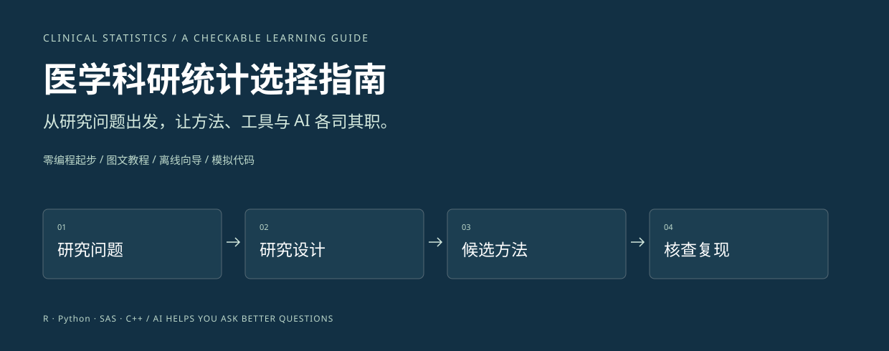
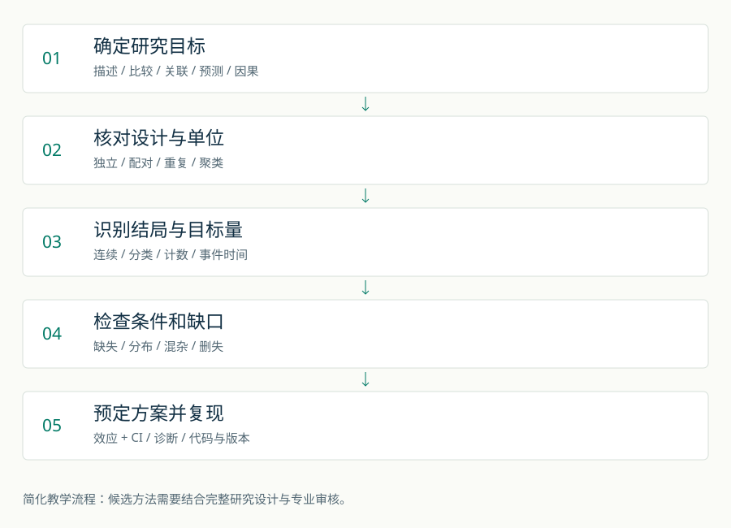
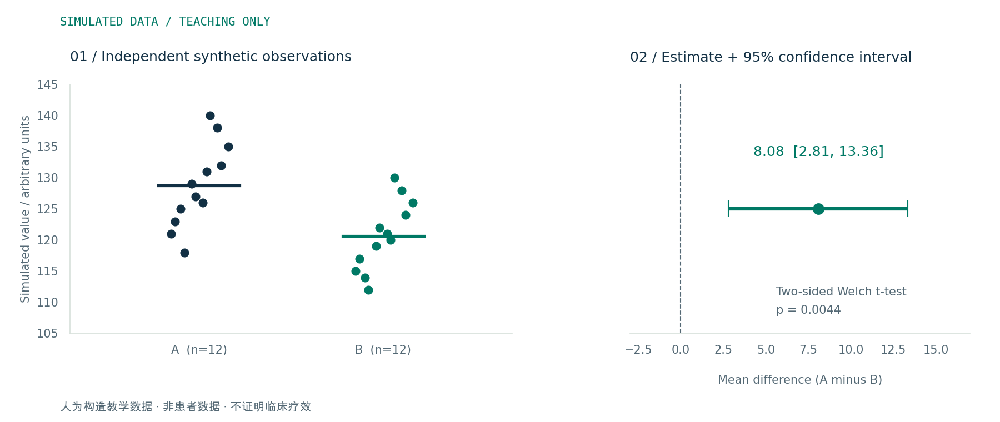
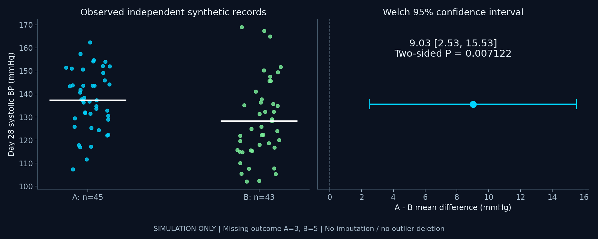

# 医学科研统计选择指南

**从研究问题出发，选择统计方法、学习工具与 AI 协作方式。**

[公开仓库](https://github.com/TUANZIDING/clinical-stats-languages-guide) · [自动检查记录](https://github.com/TUANZIDING/clinical-stats-languages-guide/actions/workflows/checks.yml)



面向没有编程基础的临床科研人员。你不需要先成为程序员，但需要说清楚：研究对象是谁、比较什么、每一行代表什么、希望估计什么。

本项目包含中文图文教程、离线交互式选择向导、AI 提问模板，以及使用同一份**人为构造教学数据**的 R / Python / SAS / C++ 示例。v2.0 增加含缺失值的模拟临床案例、Table 1、分布诊断、效应与 CI、可复现报告和第三方工具适配。它帮助形成可讨论的统计分析草案；正式研究需要结合完整方案、数据质量与统计专业意见。

## 先用起来

1. 双击 [docs/index.html](docs/index.html)，即可离线浏览和使用选择向导，无需安装依赖。
2. 或在项目根目录运行 `python3 -m http.server 8765 --directory docs`，打开 `http://localhost:8765`。
3. 按顺序阅读：[统计方法怎么选](docs/method-guide.md) → [软件与语言怎么选](docs/software-guide.md) → [用 AI 辅助选择](docs/ai-workflow.md)。

网页没有数据上传、AI API、追踪脚本或外部字体；“生成提问”生成的是需要手动复制的文本。研究描述仍可能包含敏感信息，使用外部 AI 前请按所在机构要求审查。

## 你会学到什么

| 你的问题 | 在哪里找答案 |
|---|---|
| 我应该用 t 检验、卡方还是回归？ | [方法指南](docs/method-guide.md)及网页交互向导 |
| 零编程基础能做统计吗？ | [软件选择指南](docs/software-guide.md) |
| AI 能替我选统计方法吗？ | [AI 协作流程](docs/ai-workflow.md)和[提问模板](templates/ai-statistics-prompt.md) |
| 同一个分析在不同语言里是什么样？ | [可运行示例说明](examples/README.md) |
| 结果怎么看，怎么写进论文？ | [教学案例](docs/worked-example.md)和[分析计划模板](templates/analysis-plan.md) |
| 如何检查 Table 1、缺失、CI 和图注？ | [v2.0 实操](docs/临床统计实操v2.0.md)及[报告核对](docs/统计报告核对v2.0.md) |
| 用 AI / Codex 核查分析与报告？ | [v2.0 核查提示词](templates/统计核查提示词v2.0.md) |
| 有哪些相关 GitHub 项目可以学习？ | [12 个项目导航与使用边界](docs/相关项目导航v2.0.md) |
| 这些说法有什么依据？ | [来源与适用范围](docs/sources.md) |

## 选方法的五个步骤



1. **确定问题和目标量**：描述、比较、关联、预测还是因果？要估计均值差、风险差、优势比，还是其他量？
2. **看设计和分析单位**：独立患者、同一患者前后、反复测量，还是多中心聚类？数据行数不等于独立样本量。
3. **看结局类型**：连续数值、二分类、无序多分类、有序等级、计数、事件时间。
4. **检查条件和信息缺口**：分布、异常值、缺失、事件数、混杂、删失、模型假设和多重比较。
5. **预先确定并复现**：写下主分析与敏感性分析，报告效应量和置信区间，保存代码、版本与日志。[SAMPL 指南](https://www.equator-network.org/wp-content/uploads/2013/07/SAMPL-Guidelines-6-27-13.pdf)

## 软件选择：按任务和团队条件判断

| 起点或任务 | 可以考虑的工具 | 选择理由 |
|---|---|---|
| 先理解统计、不想写代码 | jamovi / 已有许可的 SPSS | 菜单操作能降低初始操作门槛；仍需理解设计与假设 |
| 愿意学一点代码，做常规医学统计与复现 | R | 免费，围绕统计计算与图形构建的生态 |
| 影像、机器学习、批量处理、自动化 | Python | 通用语言，有统计与机器学习库；传统推断也能完成 |
| 团队使用 SAS，课程或项目需要衔接 | SAS | 跟随团队的程序、验证与交付规范更实用 |
| 开发高性能算法或底层软件 | C++ | 能进行统计计算，通常不是医学初学者的第一站 |

这是**本项目的教学建议**，不是实测软件排行榜。R 并非对所有初学者最容易；Python 不仅能做 AI；SAS 不只支持手写代码；C++ 借助数学库也能计算 P 值。代码行数不能衡量分析是否正确、易学或合规。[R 官方介绍](https://www.r-project.org/about.html)、[jamovi 官方介绍](https://www.jamovi.org/)、[Python 官方介绍](https://www.python.org/doc/essays/blurb/)、[SAS 学习入口](https://www.sas.com/en_us/software/on-demand-for-academics.html)、[Boost Math 文档](https://live.boost.org/doc/libs/1_51_0/libs/math/doc/sf_and_dist/html/math_toolkit/dist/dist_ref/dists/students_t_dist.html)

## AI 可以协助，但输出需要核查

把去标识化的**研究设计和变量字典**交给 AI，要求它先问缺失信息，再给出候选方法、适用条件、效应量、诊断步骤与可核查来源。随后用模拟数据运行代码，核对参数与结果，交由研究团队确认分析计划。WHO 提醒，生成式 AI 可能给出错误、不完整或带偏见的信息；“回答很流畅”不能作为统计正确性的证据。[WHO 指南说明](https://www.who.int/news/item/18-01-2024-who-releases-ai-ethics-and-governance-guidance-for-large-multi-modal-models)

## 一个可复现的小案例



两组各 12 个独立的**模拟**观测，用双侧 Welch t 检验估计 A−B 均值差。数值由代码实际计算；它们不是患者结果，也不证明任何疗效。见[案例解释](docs/worked-example.md)。

## 项目结构

```text
docs/           离线网页、教程、来源、统计图
examples/       同一教学数据的四种语言示例
data/           人为构造数据及变量字典
templates/      AI 提问、分析计划和结果报告模板
scripts/        图表重建、项目检查与结果一致性核查
tests/          向导关键分支与信息不足保护检查
.github/        自动检查流程、GitHub Pages 手动发布流程
```

## v2.0：从模拟数据到统计报告



- **Table 1**：96 个独立模拟对象，A / B 各 48 个；每个变量注明已知 n、缺失 n，类别百分比分母明确。基线与随访分开，默认不加 P 值。[离线基线表](docs/assets/table-onev2.0.html)
- **分布与方差检查**：Q–Q 图、偏态 CRP 分布、Shapiro–Wilk 与中位数 Levene 输出，用于诊断讨论，不按 P 值自动切换方法。Welch 不要求等方差。[实操说明](docs/临床统计实操v2.0.md)
- **结果与报告**：主要结局已知 n=45 / 43；实际计算 A−B 均值差 9.03 mmHg，95% CI [2.53, 15.53]。可下载方法、结果、图注和 CSV，附数据 SHA-256 和版本信息。数值只解释模拟计算。[报告草稿](docs/assets/clinical-reportv2.0.md)
- **工具与 AI**：可选 gtsummary 表格、ggstatsplot 注释图；核对第三方图内统计，不把标准化效应 CI 当成原始单位 CI。提供有信息缺口保护的核查提示词和 12 个资源入口。

在项目根目录运行：

```sh
python3 -m pip install -r requirements.txt
python3 scripts/clinical-reportv2.0.py
python3 tests/clinical-reportv2.0.py
```

数值核对需要 R；可选包安装与导出命令见 [实操说明](docs/临床统计实操v2.0.md)。原 24 行四语言示例保留。新增文件遵守“名称 + 版本 + 扩展名、无下划线”规则；既有名称保留。

## 维护与发布

运行 `npm test` 检查向导关键分支；运行 `python3 scripts/check_project.py` 检查本地链接与数据一致性，`python3 tests/clinical-reportv2.0.py` 检查临床教学输出及 R 数值一致性，`python3 scripts/check-filenamesv2.0.py` 检查新增文件命名。示例和图表的重建命令见 [examples/README.md](examples/README.md)。

项目已按仓库所有者确认的范围上传为公开仓库。GitHub Pages 工作流已准备，只接受手动触发；网页发布仍需要单独启用。具体步骤见 [发布说明](docs/publishing.md)。

内容核查日期：**2026-10-08**。软件文档与授权条款会变化；本指南不声称完成了真实数据分析、软件易用性试验或正式临床研究方法学审查。执行状态见 [v1 记录](VALIDATION.md)与 [v2.0 记录](验证记录v2.0.md)。

代码与本项目原创文字、图表采用 [MIT 许可证](LICENSE)；链接的第三方材料遵循各自条款。欢迎提出带设计背景和可核查依据的改进建议。
