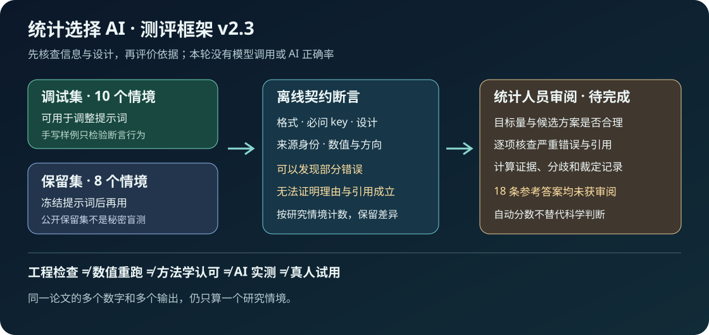

# 统计选择 AI 测评框架 v2.3

先问“它是否识别设计和信息缺口”，再问“候选方法是否有依据”。本轮建立离线案例与审阅流程；**没有调用外部模型，也没有 AI 正确率。所有参考答案仍待统计人员审阅。** 原有 v2.2 方法向导、论文目标和统计结果保持不变。



## 18 个情境，分开使用

| 分组 | 案例 | 重点 |
|---|---|---|
| 调试 T-01–T-03 | 信息不足、独立教学均值、配对平均变化 | 保留未知；同一目标可有不同候选；不能丢失配对 |
| 调试 T-04–T-05 | NHANES、medplot | 同时核查抽样 / 重复结构、目标尺度和原文差异 |
| 调试 T-06–T-10 | 结局缺失、生存目标、预测时间、稀疏事件、病例对照匹配 | 不猜缺失机制，不忽略删失 / 时间，不混淆 OR 与风险 |
| 保留 H-01–H-04 | 目标 / 等效未定、配对二分类总数、调查叠加重复、失访与死亡后结局 | 在新设计中判断缺口和条件，不能只套名称 |
| 保留 H-05–H-08 | 缺失协变量、竞争出院、患者划分预测、少聚类少事件 | 调整依据、CIF、时间泄漏及独立信息量 |

调试集用于改提示词。保留集在提示词版本冻结后使用；默认演示和 Promptfoo 配置只用调试集。`familyId` 和 `sourceStudyId` 禁止跨分组，同一论文的全部对照数字仍算一个情境。18 个情境不是从代表性研究人群随机抽样，不能外推 AI 的总体表现。

**公开可审阅的保留集不是秘密盲测。** 本实现者已编写案例；统计人员可审阅。若使用者或模型训练看过保留内容，或用它调过提示词，应标为曝光并更换新保留集。文件分开和哈希只能防止无记录改动，不能证明从未泄漏。

每条参考答案分别保存必问问题、多个有条件方案、严重错误清单、引用和计算核对要求；并标记 `pending-statistician-review`。来源入口见 [来源目录](../data/AI测评来源v2.3.json)。官方 API 文档支持具体接口，不单独证明缺失、因果或推广假设；病例参考答案的科学适用性仍需审阅。

## 从一个离线演示开始

需要 Node 18 或更新版本，不需要 npm 安装或 API 密钥。所有输出写入忽略的 `build/`。

```sh
node scripts/AI离线测评v2.3.cjs check
node scripts/AI离线测评v2.3.cjs demo
node scripts/AI离线测评v2.3.cjs compare-demo
node --test tests/AI测评测试v2.3.cjs
```

`demo` 核对 7 个实现者手写固定答案，覆盖 3 个研究情境。3 个答案满足契约；4 个故意错误涉及独立检验误用于配对、数值符号、来源 URL、不补信息便选方法。示例不是被测模型输出，不是标准答案获认可，也不是测试集的模型表现。

`compare-demo` 在**同一个**独立教学情境比较两个有条件候选的断言记录，科学胜者为 `null`。实际输出的比较必须同分组、同案例集合且每案例一条，不能把漏回答的案例悄悄丢掉。

## 自动分数只检查输出契约

| 契约轴 | 分值上限 | 可以检查 | 不能据此判断 |
|---|---:|---|---|
| 结构化格式 | 10 | 字段、类型和案例 ID | 文本内容是否统计正确 |
| 必问 key 覆盖 | 25 | 参考问题是否有对应记录 | 追问是否切中缺口；同义问题需人工映射 |
| 已给设计 / 未知项 | 20 | 单位、结构、抽样和目标 ID | 用户声明是否真实 |
| 候选元信息 | 15 | 理由、条件、诊断和引用连接存在 | 理由是否充分、诊断是否执行 |
| 引用元信息 | 10 | 注册入口 ID 与 URL 相符 | 主张是否获支持；新来源可能有效 |
| 计算核对契约 | 20 | 计划 key、诚实运行状态、冻结数值 / 方向 / 算法 | 计划已执行、代码可重跑或方法有效 |

默认契约阈值 80。有设计冲突、来源身份矛盾、数值差异或缺口时，即使契约完整性很高也不通过。新候选 / 新引用转人工核查，不自动宣称其错误。实际方法评价应使用 [统计人员审阅表](../templates/统计人员审阅v2.3.md)，与自动分数分开报告。

特别注意：把严重错误写在自由文本里、只填正确 key 却解释错误、给错误主张配一个真实 URL，可能骗过这些断言。**自动通过仍然是待方法学审阅。** 本轮未校准断言灵敏度、特异度、评分者一致性或模型效度，也不报告这些指标。

T-02 有 3 个既有冻结教学数值，来源和容差随案例保存。核对这些数字是快照比较，不是重新计算 t 检验。其余多数案例仅提供设计，合理答案应说明尚未计算；列出检查计划不等于诊断通过。公共论文原来的 72 / 27 个对照及默认软件差异继续独立保留，没有加入为多个 AI 测评样本。

输出契约的 `sampling:simple` 仅表示“没有已声明的复杂调查设计”，不宣称简单随机抽样、总体代表性或因果可识别性。虚构病例对照等案例的抽样和选择机制仍要在文字中论证。

## Promptfoo 接口与真实离线运行

借鉴 [Promptfoo 配置](https://www.promptfoo.dev/docs/configuration/reference/)、[JavaScript 断言](https://www.promptfoo.dev/docs/configuration/expected-outputs/javascript/)和 [Echo](https://www.promptfoo.dev/docs/providers/echo/)。配置使用自定义 `-c` 路径，`providerOutput` 接入固定答案，只有文件断言，没有 `llm-rubric`、embedding 或外部模型评审。实现及案例为原创，不复制上游实现；核查 npm 0.124.1 的 MIT 许可，上游署名及安装包许可保留。

独立 runner 是主要离线入口。Promptfoo 是可选兼容核查，Node 至少 22.22.0；首次安装需要访问 npm，**安装不是离线步骤**，工具和固定内部文件仅存入忽略目录：

```sh
npm install --prefix build/Promptfoo工具v2.3 --no-save --package-lock=false --no-audit --no-fund promptfoo@0.124.1
node scripts/AI离线测评v2.3.cjs export-promptfoo
```

macOS 可在进程级网络禁用下运行（不改变系统网络设置）：

```sh
PROMPTFOO_DISABLE_TELEMETRY=1 PROMPTFOO_DISABLE_UPDATE=1 \
PROMPTFOO_DISABLE_SHARING=true PROMPTFOO_CONFIG_DIR="$PWD/build/Promptfoo状态v2.3" \
sandbox-exec -p '(version 1) (allow default) (deny network*)' \
build/Promptfoo工具v2.3/node_modules/.bin/promptfoo eval \
-c config/Promptfoo离线配置v2.3.json --no-cache --no-table \
--no-progress-bar --no-write --no-share -o build/Promptfoo断言报告v2.3.json
```

负例故意失败，Promptfoo 非零退出可由这些预设错误产生，必须检查具体错误，不能把任意非零退出都当成功。本项目将兼容结果与预定的 3 个通过 / 4 个失败逐项核对，见 [本轮核查记录](../验证记录v2.3.md)。其他系统的网络隔离尚未验证；无隔离机制时使用独立 runner。关闭遥测 / 更新 / 分享不单独证明没有网络访问。[Promptfoo 遥测说明](https://www.promptfoo.dev/docs/configuration/telemetry/)

```sh
node scripts/Promptfoo结果核查v2.3.cjs build/Promptfoo断言报告v2.3.json
```

0.124.1 将预期断言失败原因放入 `error` 字段，不能仅看该字段就误报运行错误；本项目同时核查失败类型、具体原因与统计运行错误数。本次导出还将部分来源哈希脱敏成 `[REDACTED]`。保留这种软件差异，原始输入和来源仍使用项目 fixture / 独立 runner；不把脱敏导出冒充完整原始模型输出。

Promptfoo 控制台显示的通过比例只属于这 7 条手写断言样例，不能转写为 AI 正确率。本框架的公开说明和机器可读结果将 AI 正确率保留为空。

## 未来接入已经保存的模型输出

本 runner 不生成模型答案。下列命令只导出输入或检查用户明确提供的已有输出文件：

```sh
node scripts/AI离线测评v2.3.cjs prompts --split tuning
node scripts/AI离线测评v2.3.cjs run --split tuning --outputs build/实际输出v2.3.json
node scripts/AI离线测评v2.3.cjs prompts --split holdout --frozen-prompt --out build/保留输入v2.3.json
```

调试输入含案例 ID、研究描述和通用来源目录；不含参考答案、严重错误清单或冻结数值。提示词文件和每条渲染输入均记录哈希，案例集有独立哈希。未来生成输出时还需保存实际模型名称与版本、日期、提示词、采样参数、工具 / 检索和原始答案；声明本身仍需要审计，不能证明模型运行或保留集独立。

已有输出文件的最小外层契约如下，`output` 按 [测评提示词](../templates/AI测评提示词v2.3.md) 的结构填写；此处是格式说明，不是虚构的真实运行记录：

```json
{
  "kind": "stored-model-outputs",
  "split": "tuning",
  "provenance": {
    "modelId": "实际模型标识，未运行则不填写",
    "modelVersion": "实际版本",
    "generatedAt": "实际运行时间",
    "samplingParameters": {"temperature": "实际值或说明不适用"},
    "toolsOrRetrieval": "实际工具或明确 none",
    "promptSha256": "实际提示词模板哈希",
    "datasetSha256": "对应分组冻结文件哈希"
  },
  "records": [{"id": "实际输出记录 ID", "caseId": "T-01", "output": {}}]
}
```

保留输出另需 `usedForPromptTuning:false` 和 `promptFrozenBeforeHoldout:true`，但这两项不能替代操作审计。不同提示词的已有输出可用 `compare --outputs ... --right ... --prompt ... --right-prompt ...` 比较；必须提供对应真实提示词文件。当前没有这样的实际输出，所有科学结论为空，框架不聚合 AI 正确率。

## 下一步与当前限制

统计人员审阅 18 条参考答案与主张支持、实际模型运行及保留情境的独立评价均未完成。框架工程测试不替代方法学审阅、AI 实测、数值重跑或真人学习试用。[初次本地验收](../验证记录v2.3.md)保留当时未发布状态；本次收尾、合并与部署结果另见[发布记录](../发布记录v2.3.md)。
