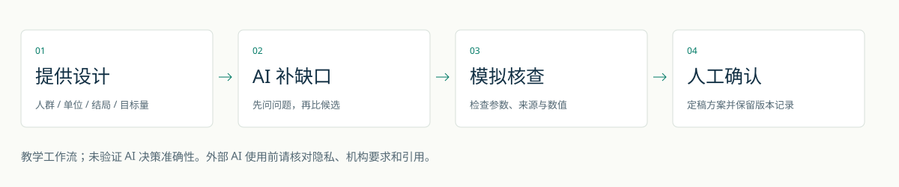

# 用 AI 指导统计选择：让它帮助推理，不省略核查

AI 可以解释术语、帮你完善设计描述、列候选方法、生成模拟代码、整理诊断清单和改写统计报告。它可能遗漏配对关系、选错模型、混淆目标量、生成不存在的文献，或用看起来正确的代码计算另一种分析。

WHO 的生成式 AI 指南明确讨论了错误、不完整、偏倚信息与自动化偏见的风险。本项目据此设计“信息补全 → 方法比较 → 模拟验证 → 人工确认”的教学流程；这不是经过验证的 AI 统计决策系统。[WHO 指南说明](https://www.who.int/news/item/18-01-2024-who-releases-ai-ethics-and-governance-guidance-for-large-multi-modal-models)

## 工作流

1. **给设计，不先给患者明细**：研究类型、纳排标准、结局定义、分析单位、分组、时间点、变量字典、总样本量与事件数等。是否能传真实数据取决于机构要求、许可与平台条件，去掉姓名并不一定足够。
2. **让 AI 先问缺口**：缺失机制、配对、中心、删失、混杂、主要结局及目标量不明确时，先停下来补充。
3. **让 AI 比较候选**：每种方法分别说明目标量、适用条件、局限和需要的诊断。不要只返回一个名称。
4. **要求可核查来源**：优先官方文档、方法学原始论文或指南；亲自打开核对引用与结论，不能把 AI 提供 DOI 当成已验证。
5. **用模拟数据运行代码**：核对两侧/单侧、分组顺序、参考组、方差、缺失、配对 ID、单位和软件版本。与已知结果或另一实现对照。
6. **交给研究团队确认**：预定分析计划后才进行正式研究分析；变更记录原因，探索性分析单独标注。
7. **报告并保存**：效应量、CI、样本量、缺失处理、诊断、敏感性分析、脚本、日志与版本。[SAMPL](https://www.equator-network.org/wp-content/uploads/2013/07/SAMPL-Guidelines-6-27-13.pdf)

## 三个容易误导 AI 的问法

| 不完整的问法 | 为什么不够 | 可以补充成 |
|---|---|---|
| “两组数据用什么检验？” | 不知道结局类型、独立性、设计 | “两独立组，连续结局，关注未调整均值差；每人一次测量，样本量和缺失如下……” |
| “不正态是不是用非参数？” | 忽略目标量、结构和分布细节 | “关注什么量？有哪些异常值？样本量多少？秩方法是否仍回答原问题？” |
| “帮我得到显著结果。” | 改变问题以追逐 P 值 | “按预定方案估计效应与不确定性；如果精度不足，请解释并提出后续设计建议。” |

## 可直接复制的模板

见 [完整 AI 提问模板](../templates/ai-statistics-prompt.md)。网页“生成 AI 提问”会把你的设计选项组合成模板文本；**不会调用 AI，不会验证假设，也不会运行真实数据**。

v2.2 第 2 步加入[研究卡片](研究卡片说明v2.2.md)：问题、人群、结局、目标量、分析单位、抽样、数量、时间、缺失和调整依据随候选与缺口一起导出。修改输入后需重新生成。请要求 AI 区分用户声明、教学假设和已核查事实，不把填过字段当成方法条件已验证。

## 核对 AI 输出的十项内容

- 研究设计与目标量是否被准确复述？
- 是否将数据行数当成独立患者数？
- 配对、重复测量和聚类是否处理？
- 缺失、删失、事件数与稀疏性是否讨论？
- 调整变量的选择是否有设计和领域依据？
- 参数设置、分组顺序与效应方向是否一致？
- 是否混淆 OR、RR、HR 或相关与因果？
- 引用是否真实且支持对应方法？
- 代码是否在模拟数据中成功运行并复核？
- 是否记录了诊断、限制与需要人工确认的事项？

## AI 记录表

使用日期、工具/模型标识、提示词、输出、引用核查、代码版本、测试结果、人工修改及审核人。如果期刊或机构要求披露 AI 使用，按相应最新要求执行；本项目不替代这些要求。

## v2.3：先搭测评框架，再做模型实测

[统计选择 AI 测评框架](AI测评框架v2.3.md)建立 10 个调试与 8 个保留情境，以及离线断言、成对输出比较和[统计人员审阅表](../templates/统计人员审阅v2.3.md)。默认只演示手写固定输出，不调用模型。必问 key、引用入口或保存数字核对通过，仍不能证明方法依据正确、引用支持结论或计算已经执行。18 条参考答案均待统计人员审阅；AI 实测、专家审阅及真人试用仍未完成。
