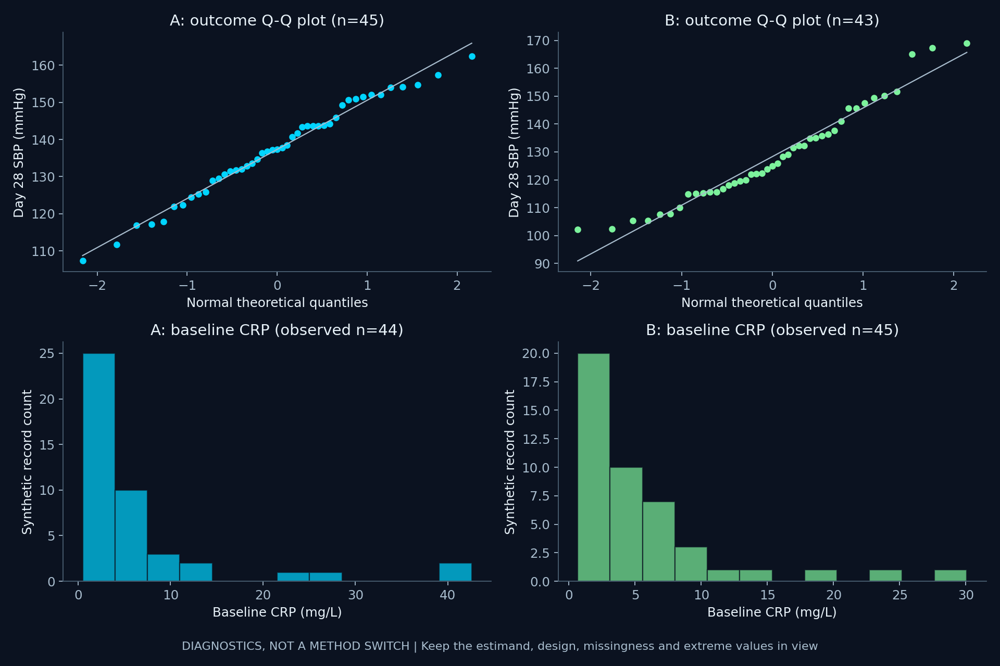

# 临床统计实操 v2.0

这一版把“认识工具”推进到“检查统计报告”。可以运行模拟案例、生成基线表、观察分布并起草方法与结果；真实论文仍需要研究方案、数据质量评估和人工审核。整洁的表格不证明方法适用。

## 先把研究问题写清楚

先固定人群、设计、独立单位、主要结局及时间点、比较方向和目标量，再选方法。这里的教学问题是：96 个独立模拟对象分为 A / B，各 48 个，估计第 28 天收缩压的 A−B 均值差（mmHg）。不调整协变量，双侧 Welch t 检验，95% CI；只有一个主要教学比较。样本数不是功效计算结果，分组不是实际试验。

有基线测量并不自动意味着当前组间比较是配对检验。本例比较的是两独立组的随访结局；同一对象前后变化的比较、基线调整的 ANCOVA 或混合模型，回答不同或更具体的问题。正式随机试验应结合方案讨论基线调整；观察性研究还需要混杂结构和设计论证，不能按 Table 1 的 P 值筛协变量。

## Table 1：说明谁被观察了

[离线基线表](assets/table-onev2.0.html) · [CSV 导出](assets/table-onev2.0.csv) · [变量字典](../data/变量字典v2.0.md)

- 年龄和基线收缩压：均值 (样本 SD)。CRP：中位数 [Q1, Q3]。这些展示规则在教学脚本中显式固定，没有按 Shapiro P 值自动改变。
- 连续变量注明已知 n，每个变量单列缺失数；类别显示 `n / 已知分母 (%)`，缺失不进入百分比分母。Q1 / Q3 使用线性插值，与 R `quantile(type=7)` 对齐。
- 基线表不混入随访结局，后者单独报告。原始 n=48 不等于每个变量或每个分析的 n。
- 默认不加基线 P 值。CONSORT 2025 不推荐随机试验基线组间差异的显著性检验；观察性研究的描述也不能替代混杂调整依据。[CONSORT 2025 说明](https://www.bmj.com/content/389/bmj-2024-081124)

## 分布与方差检查：提供诊断信息



上排为各组**随访结局**的正态 Q–Q 图：每点一个已观测独立模拟对象，A=45、B=43；参考线由正态理论分位数拟合。下排为**基线 CRP**直方图：A=44、B=45 个已知值，柱高为记录数，不是概率密度。两行使用不同变量和单位，不能混读。缺失不绘制，未删除极端值。

脚本同时记录 Shapiro–Wilk W / P，以及以组中位数为中心的 Levene F / P（Brown–Forsythe 形式）。没有“通过/失败”的自动选法规则：P>0.05 不证明正态或等方差，P≤0.05 也不自动证明秩方法回答了原来的均值差问题。小样本的诊断功效、较大样本对微小偏离的敏感性，以及图形、尾部和极端值，都需要一起考虑。[SciPy Shapiro](https://docs.scipy.org/doc/scipy/reference/generated/scipy.stats.shapiro.html)、[SciPy Levene](https://docs.scipy.org/doc/scipy/reference/generated/scipy.stats.levene.html)

Welch 不要求两组方差相同，所以不需要先让 Levene “通过”。它仍依赖独立性和适当的均值推断条件；严重偏态、极端值、小样本、聚类等不能由“用了 Welch”一并解决。异常值首先核对来源与测量，按预先规则处理并报告数量；不能为得到显著结果删除点。敏感性分析应根据原目标量和设计事先说明，不能反复换方法挑 P 值。

## 报告效应与不确定性


本例实际计算的 A−B 均值差为 **9.03 mmHg，95% CI [2.53, 15.53]**，双侧 P=0.007122；这是模拟计算，不能解读成临床疗效。均值差本身就是有单位的效应量，不必为“有了效应量”强制换成 Cohen d 或 Hedges g。若用标准化量，必须定义分母、偏差校正、方向和 CI 方法，不能将其 CI 与原始单位 CI 混用。

图中左侧每点一个已观测模拟对象（A n=45、B n=43），横线为组均值；右侧点为 A−B 均值差、横线为 Welch 95% CI、虚线为零差异。缺失 A=3 / B=5，未插补。每张图的 n、单位、点和误差线含义需要写进图注。[SAMPL](https://www.equator-network.org/reporting-guidelines/sampl/)

置信区间描述估计的不确定性；不能说“这一个区间有 95% 概率包含固定真值”。临床重要性需要预先提出的有依据阈值，本案例没有。P 值不能提供效应大小或原假设为真的概率。

## 运行与复核

在项目根目录执行（Python 3.12、R 需另外安装）：

```sh
python3 -m pip install -r requirements.txt
python3 scripts/clinical-reportv2.0.py
python3 tests/clinical-reportv2.0.py
Rscript examples/r/clinical-crosscheckv2.0.R
```

第一条教学脚本读取已有版本化 CSV，重建结果 JSON、网页本地 JS、表格 CSV / HTML、图表和 [报告草稿](assets/clinical-reportv2.0.md)。只有显式使用 `--generate-data` 才重新生成数据；生成环境与种子见变量字典。R 用基础 stats 独立重算 Table 1、Welch、Shapiro 和中位数 Levene。验证涵盖 76 个数值；Shapiro 近似算法容差 1e-6，其余相对容差 1e-9。

## 可选：gtsummary 与 ggstatsplot

基础教学、离线网页和核心 CI 不依赖这两个包。它们用于学习第三方表格与注释图的工作流，不能代替主分析或审核。

在 R 中按需要安装：

```r
install.packages(c("gtsummary", "gt", "jsonlite"), repos = "https://cloud.r-project.org")
# 若需要带统计注释的图，再安装依赖较多的 ggstatsplot
install.packages("ggstatsplot", repos = "https://cloud.r-project.org")
```

随后在项目根目录执行：

```sh
Rscript examples/r/clinical-tablesv2.0.R
Rscript examples/r/clinical-tablesv2.0.R --plot
```

导出到忽略的 `build/` 目录，文件均带 v2.0。gtsummary 显式设置汇总规则、百分比分母、缺失展示且没有 `add_p()`。它的内置 `{p25}` / `{p75}` 使用 `type=2`；本案例用自定义单变量函数显式计算 `type=7` 的 Q1 / Q3，与 Python / 基础 R 核心表格对齐，并自动核对导出的摘要单元格。网页核心表格由原创脚本生成，不直接载入第三方 HTML。[gtsummary tbl_summary 官方说明](https://www.danieldsjoberg.com/gtsummary/reference/tbl_summary.html)

ggstatsplot 使用 `type="parametric"`、双侧、95% CI、`pairwise.display="none"`、`bf.message=FALSE`；按当前官方文档其两组参数检验使用 Welch。图中标准化效应与本例原始均值差不是同一量，标准化 CI 也不是 mmHg 区间。脚本提取图内统计与核心 Welch 的有符号 t、P 核对，记录依赖版本。[ggbetweenstats 参数与默认值](https://www.indrapatil.com/ggstatsplot/reference/ggbetweenstats.html)、[extract_stats](https://www.indrapatil.com/ggstatsplot/reference/extract_stats.html)

这次实际运行的图内 Hedges g 为 0.5856，95% CI [0.1585, 1.0091]，方向 A−B。当前调用链使用 `effectsize::hedges_g(a, b, pooled_sd=FALSE)`，非合并 SD 标准化并进行小样本偏差校正，CI 使用非中心 t 参数法；脚本独立调用该函数核对图内 g 与 CI。它是无单位的辅助展示，不替代主报告的 mmHg 均值差。定义与参数见 [effectsize 官方文档](https://easystats.github.io/effectsize/reference/cohens_d.html)。

各模块的实际运行状态见 [v2.0 验证记录](../验证记录v2.0.md)。首次安装可涉及编译工具和更多依赖；不要把安装成功、漂亮图表或跨语言一致误当作临床研究方法已审核。

## 换成真实研究前

先使用 [统计报告核对清单](统计报告核对v2.0.md) 和 [AI 核查提示词](../templates/统计核查提示词v2.0.md)。确认分析单位、主要时间点、基线调整、缺失处理依据、样本量、方案变更、多重性、诊断与敏感性分析。遇到重复测量、聚类、非随机比较、删失或稀疏事件时，需要重新设计分析，不能替换 CSV 后机械运行本例。
