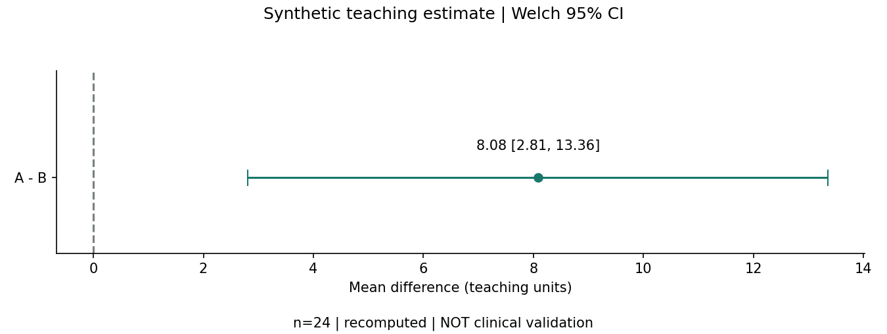
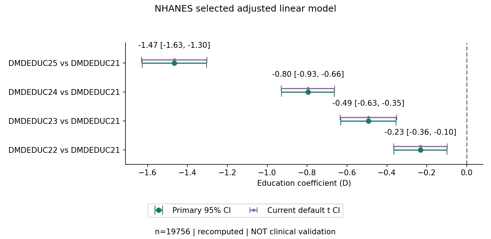

# 三层教学路径 v2.2 · 第 5 步

从项目根目录操作。先能说明问题，再运行模拟案例，最后限定复现论文。网页按钮和本文件使用同一课程源；阅读、勾选或回答练习不等于实际运行分析或学习效果验证。

课程结构参考 [learn-r-with-ai](https://github.com/htlin222/learn-r-with-ai/tree/5d0ac23bf48f6e0666b1681bc55532e6f69fd295)，核查提交 `5d0ac23bf48f6e0666b1681bc55532e6f69fd295`（2026-09-14）。该课程按任务推进数据、表格、图与检验，并安排运行与解释。本项目只借鉴组织顺序，未复制上游代码、任务文字或数据；练习、反馈和程序原创。上游 [MIT 许可](https://github.com/htlin222/learn-r-with-ai/blob/5d0ac23bf48f6e0666b1681bc55532e6f69fd295/LICENSE)，Copyright (c) 2025 林協霆 (Hsieh-Ting Lin)；不因此改变论文 / 数据 / 作者代码的各自许可。

## 先做一个小任务

1. 双击 [离线网页](index.html#learning)，选择“零基础理解”。填写问题、人群、结局、目标量和分析单位；未知项保留待补充。
2. 判断配对、OR 与等效的三个错误论断。每个错误选项有解释与下一步，修改选择后需重新核对。
3. 已安装 R 时运行 `Rscript --vanilla examples/r/welch_demo.R`，保存输出并解释 A−B 的方向。没有 R 时先读 [已保存计算报告](计算报告示范v2.2.html)，不要记作已运行。

## 环境与执行边界

- 模拟两组和临床核对脚本只用基础 R stats；系统 R 必须另外安装。新计算报告用 Python 标准库，不要求 Quarto。它先实际重算一个小例子，再核对 HTML 与主网页的 4 个数值字段。
- 论文环境与完整命令见 [统一结果 / targets / renv 说明](结果对象与复现v2.2.md)、[NHANES 记录](论文验证v2.1.md)与 [medplot 记录](纵向论文验证v2.2.md)。先恢复锁定 R / Python 包、显式获取冻结公共输入，再执行完整入口；首次可能联网或编译。只使用本项目许可范围内的公共输入。
- `npm run check:offline`、统一 / 纵向结果脚本的 `check` 和计算报告的 `check` 都核对快照，**不会重新拟合模型**。实际重算入口、依赖和输出分开说明；浏览器只显示保存结果。
- 历史作者代码版本、冻结目标 / 容差、数据哈希、原始运行失败与软件算法差异全部保留。四个案例的统计数字来自既有共同结果视图；这个教学层不更改它们。

## 小型可计算报告示范

`python3 scripts/计算报告v2.2.py run` 实际调用既有 R 脚本，核对 10 个冻结数值和 4 个主网页来源字段，保存到忽略的 `build/计算报告示范v2.2/`。维护者用显式 `run --export` 更新本地独立 HTML 与它的运行记录；不修改共同结果、冻结目标或论文记录。`check` 无需 R、只审计已交付快照。脚本、数据、参考与网页来源有 SHA-256，运行记录包含 R / stats / BLAS / Python / 系统版本。

这是原创 R + HTML 的小示范，没有迁移整站到 Quarto，也没有验证 Quarto 环境。只重新计算现有 24 例模拟；同主机运行不等于跨系统环境恢复。

## 学习任务与反馈


### 1. 零基础理解

交付：交付一张研究卡片，说明希望估计的量与数据关系。

1. 先写问题：人群、比较对象、结局与时点。
2. 再标关系：每行是谁？同一个人是否出现多次？不知道就保留待补充。
3. 读效应：均值差有单位；OR 是优势比；P 值与临床意义分开。
4. 完成下方判断练习，再把仍缺的信息写进方法向导。

#### 判断练习：遗漏配对关系

虚构设计：同一批患者治疗前后各记录一次阳性 / 阴性。只有前后阳性总数，尚无逐人配对表。第一步做什么？

1. 当作两独立组做卡方检验。

   反馈：需要修正。同一人前后相关；独立组检验丢掉关系。补充患者 ID 和逐对四格表，核查不一致对。

2. 保留配对关系，补逐对数据和不一致对，再讨论 McNemar 等候选方案。

   反馈：判断有依据。选择依据来自配对二分类结构；总阳性人数不够。样本量 / 不一致对稀疏程度与精确方案仍待核查；本轮没有新跑配对检验。

3. 没有显著变化就说明治疗前后等效。

   反馈：需要修正。既没有足够配对信息，也没有等效界值与等效设计；不显著不能证明等效。

下一步：研究卡片写：分析单位=患者；结构=配对；逐对记录、不一致对数=待补充。

#### 判断练习：把 OR 解释成风险比

某 Logistic 输出写 OR=2。可以直接说“发生风险增加一倍”吗？这是尺度判断示意，不是新复算的结果。

1. 可以，OR 与风险比只是两种写法。

   反馈：需要修正。优势=p/(1−p)，风险=p；两种比值不同。不能把 OR 的增幅直接解释成风险增幅。

2. 只要 P<0.05 就可以这样写。

   反馈：需要修正。显著性不改变目标量。还要核对事件定义、时点、人群及条件 / 边际尺度。

3. 报告优势比及其 CI，并核对研究是患病还是随访；需要风险解释时另行明确目标量。

   反馈：判断有依据。先保留 Logistic 回答的优势比。NHANES 是横断面患病 OR；medplot GLMM 是条件 OR。不能自动转成风险比。

下一步：写清优势比、参考组、事件编码、CI 算法，以及条件或边际尺度；风险目标仍需设计和适当分析。

#### 判断练习：不显著不等于等效

虚构报告只写“两组差异 P>0.05，因此两方案等效”。尚无临床界值或等效方案，怎样修改？

1. 报告估计与 CI，并写证据不足以支持差异；不能据此判等效。

   反馈：判断有依据。未拒绝零差异不证明效果相同。等效需要事先有依据的界值、相应设计与区间判断；本项目未验证等效分析。

2. 把结论改成“两组完全相同”。

   反馈：需要修正。P 值不是相等的概率，宽区间可能同时容许重要获益和伤害。

3. 不断增加协变量，直到 P 值显著。

   反馈：需要修正。事后追逐显著性改变分析问题，也不能证明等效。调整需要科学依据和预定方案。

下一步：补估计、CI、研究设计和临床重要性依据；没有等效界值时保留“等效信息待补充”。

### 2. 模拟数据实操

交付：交付一次运行记录，核对分母、方向、区间及诊断边界。


#### 两独立组：先读懂一个均值差

**问题：** 用人为构造的 A、B 各 12 个独立观测，演示如何估计组间总体均值差。没有患者或实际干预。

**目标量：** A−B 未调整总体均值差；双侧 95% CI。模拟变量没有临床单位，不添加疗效解释。

**理由：** 目标是均值差，教学设计预先规定独立性；Welch 不要求等方差。不是按哪个检验的 P 值更小来选择。

**可运行步骤：**

1. 在项目根目录打开终端。R 需事先安装；本例只用基础 stats，无需安装包。

```sh
Rscript --vanilla examples/r/welch_demo.R
```

2. 读输出的组人数、difference、ci_low / ci_high、p_value；确认第一个向量 A 减第二个向量 B。
3. 运行小型计算报告：实际重算并核对主网页来源；生成到 build，不改原网页或冻结目标。

```sh
python3 scripts/计算报告v2.2.py run
```

**诊断解释：**

- 已做：已核对 ID 唯一、分组、缺失及有限值。
- 解释：保证这份输入可以按预定脚本计算；ID 唯一不能证明真实研究没有家庭或医院聚类。
- 待查：小样本的分布、极端值及独立性解释仍需核查，不能把数值交叉一致写成假设通过。

**结果解读：** 同时报告比较方向、均值差和区间；P 值不提供临床重要性或原假设为真的概率。

统计数字从共同对象生成：[三案例结果](assets/分析结果v2.2.json) / [纵向结果](assets/纵向论文结果v2.2.json)，不在本课程手工转抄。



**常见错误：**

- 调换 A / B 后仍写 A−B。
- 把软件默认参数相同当作方法相同；SciPy 需显式 equal_var=False。
- 把小 P 值写成治疗有效。

#### 判断练习：仅凭正态性 P 值选方法

均值差是预定目标。一组 Shapiro P>0.05，同事说“正态已证明，Welch 的所有条件都满足”。最恰当的反馈？

1. 同意，P>0.05 就证明总体正态。

   反馈：需要修正。不拒绝不等于证明；小样本尤其可能缺乏发现偏态的能力。

2. 仍需核对独立性、图形、极端值和小样本条件；诊断用于解释，不自动切换目标量。

   反馈：判断有依据。Welch 不要求等方差，但独立性与均值推断条件仍需要依据。项目只完成部分计算检查。

3. 一旦 P<0.05，换秩检验仍然必定估计相同均值差。

   反馈：需要修正。秩方法通常回答分布 / 秩相关问题，不能不加解释地替代原均值差目标。

下一步：在诊断记录分开写“已执行检验 / 图形待解读 / 独立性待查”，保留原目标量。

[案例细节](worked-example.md) · [方法 / 原文来源](https://stat.ethz.ch/R-manual/R-devel/library/stats/html/t.test.html)

#### 含缺失的模拟案例：分母与诊断

**问题：** 96 个独立模拟对象，A / B 各 48 个。估计第 28 天收缩压的组间差异；不是已实施临床试验。

**目标量：** 第 28 天 A−B 未调整均值差，mmHg；仅使用观测结局。缺失时它与全体目标人群均值差的联系需要额外假设，不能默认无偏。

**理由：** 演示预定 Welch 均值推断和逐变量 Table 1。基线资料的存在不自动把独立组随访比较变成配对检验；调整依据需要方案与因果结构。

**可运行步骤：**

1. 运行基础 R 独立核对：实际重算 Table 1、Welch、Shapiro 和中位数 Levene，输出机器可读数值。

```sh
Rscript --vanilla examples/r/clinical-crosscheckv2.0.R
```

2. 打开下方统计实操：核对已知分母、缺失行与结果段。这个网页展示保存产物，不在浏览器拟合。

```sh
python3 scripts/统一结果v2.2.py check
```

3. 若要更新完整共同结果对象，按复现说明恢复环境后运行 targets 入口；不要单独手改表或图里的数字。
**诊断解释：**

- 已做：已计算分组 Shapiro W / P 和以中位数为中心的 Levene F / P。旧 Q–Q / CRP 图仍为冻结 v2.0 图。
- 解释：检验给出分布或方差差异的线索；P>0.05 不证明正态或等方差。Welch 不以 Levene“通过”为前提。
- 待查：Q–Q 图的人工解释、极端值来源、缺失机制与敏感性分析尚未完成；正态性 P 值不自动切换方法。

**结果解读：** Table 1 每个变量使用自己的已知分母；结局缺失不等于零，也不因基线变量缺失额外删掉已知结局。observed outcome only 指仅观测结局，no imputation 指未插补，不代表缺失机制已确认。

统计数字从共同对象生成：[三案例结果](assets/分析结果v2.2.json) / [纵向结果](assets/纵向论文结果v2.2.json)，不在本课程手工转抄。


**常见错误：**

- 所有百分比一律除以 48。
- 把缺失结局补成零；或对所有字段整行删除。
- 按单因素或基线 P 值挑协变量。

#### 判断练习：用错分母与缺失处理

模拟 A 组总数 48，已知结局 45；基线性别已知 47。应该怎样报告？

1. 把所有百分比分母写 48，结局分析也写 n=48。

   反馈：需要修正。总人数、变量已知数和分析人数不同。不要把缺失记录计作已观测结局。

2. 把未知结局补成 0，保证分母一致。

   反馈：需要修正。这会制造观测并改变估计，未获预定缺失处理依据。

3. 分别报告组总数、变量已知分母与结局分析人数，说明未插补。

   反馈：判断有依据。本例性别百分比按已知 47 人，结局分析按 45 人。不同分母可以合理存在，关键是透明记录；缺失机制仍待核查。

下一步：Table 1 注明逐变量分母与缺失；结局另报分析人数、缺失数和处理，不默认为 MCAR。

#### 判断练习：按单因素 P 值选协变量

只有 Table 1，尚无研究方案。同事建议“只把单因素 P<0.05 的变量加入调整模型”。应如何回应？

1. 先依据问题、设计、因果关系与事先知识讨论调整集；未明确时保留待补充。

   反馈：判断有依据。基线或单因素 P 值不是混杂变量的定义；数据驱动筛选也可能纳入中介或碰撞变量。当前模拟案例不额外拟合新调整模型。

2. 同意，P 小就是混杂因素。

   反馈：需要修正。混杂涉及暴露、结局与因果结构，不能由一个关联 P 值定义。

3. 变量越多越可靠，全部加入。

   反馈：需要修正。事件 / 样本量、共线性、过拟合及变量角色都需考虑；不能用数量替代调整依据。

下一步：研究卡片补“调整目标 / 依据 / 预定变量”；未知时写待补充，不自动从 Table 1 筛选。

[案例细节](临床统计实操v2.0.md) · [方法 / 原文来源](https://www.equator-network.org/reporting-guidelines/sampl/)

### 3. 公开论文限定复现

交付：交付逐项对照表；分别记录一致、差异和未复现。


#### NHANES：抽样设计与软件差异

**问题：** 2019 年近视与教育论文：美国 NHANES 横断面调查中，教育水平与屈光度 / 近视如何关联？只复算已冻结的四个模型及选定流程。

**目标量：** 教育组 2–5 相对组 1 的调整 / 未调整屈光度关联差异（D），以及近视患病优势比 OR。不是发生风险比或教育的因果效应。

**理由：** 连续结局使用调查线性模型，二分类结局使用调查 Logistic 模型；权重、分层与 PSU 是抽样设计的一部分。协变量依据原文限定复现，仍保留当前方法学讨论。

**可运行步骤：**

1. 先读原文目标及作者代码版本记录，冻结目标不随软件结果修改。快速检查只核对保存对象，不读取公共个体数据或重拟合。

```sh
npm run check:offline
```

2. 完整入口需要 R 4.5.2、恢复锁定包与 Python 环境，并显式获取 / 核对 15 个公共文件；按“统一结果来源与复现”的命令操作。

```sh
CLINICAL_PYTHON="$PWD/build/Python恢复环境v2.2/bin/python" Rscript --vanilla scripts/运行流水线v2.2.R
```

3. 比较原文算法与当前默认 t 区间两套输出。作者 R Markdown 未执行；这是项目独立实现的限定数值复现。
**诊断解释：**

- 已做：已核对输入 SHA-256、ID、权重及设计字段，记录模型收敛、观测数和设计自由度。
- 解释：非等概率抽样下，权重影响目标总体，分层 / PSU 影响方差；人数不是加权总体规模。收敛只说明拟合算法结束。
- 待查：残差、非线性、影响点、缺失机制与调整集尚未完整评价。domain 敏感性输出与原文筛选后建设计分别保留。

**结果解读：** 原文正态 Wald 区间与当前软件默认 t 区间可能不同；报告算法与自由度，差异保留。横断面患病 OR 不能写成未来风险或发病率。

统计数字从共同对象生成：[三案例结果](assets/分析结果v2.2.json) / [纵向结果](assets/纵向论文结果v2.2.json)，不在本课程手工转抄。



**常见错误：**

- 只下载 CSV，忽略调查权重、分层和 PSU。
- 用 PubMed 收录替代 SCIE 证据。
- 选定数字一致后宣称整篇论文或方法学已验证。

#### 判断练习：遗漏复杂抽样设计

NHANES 教育与近视案例已下载，能否直接用普通独立样本 Logistic 替代原调查模型，宣称复制论文？

1. 可以，只要样本数相同。

   反馈：需要修正。相同样本数不能保证相同目标量与方差。需要权重、分层、PSU、合并周期与 domain 处理。

2. 保留设计字段，核查适当权重、周期及子人群定义，再运行冻结模型并对照算法。

   反馈：判断有依据。原文算法复现与当前抽样方法讨论分别保留；改变筛选 / domain 或区间算法时记录差异，不更改期望值。

3. 只加调查权重就足够，分层和 PSU 不影响区间。

   反馈：需要修正。权重不涵盖整个抽样设计；分层与 PSU 影响方差、设计自由度和不确定性。

下一步：研究卡片写复杂抽样；记录权重 / 分层 / PSU / 周期 / domain 和来源，缺字段时不默认简单随机抽样。

[案例细节](论文验证v2.1.md) · [方法 / 原文来源](https://wwwn.cdc.gov/nchs/nhanes/tutorials/varianceestimation.aspx)

#### medplot：重复访视与条件 OR

**问题：** 公开 EM 队列在计划基线、14、180、365 天访视中，恶心强度与恶心存在如何变化？复现的是时间关联，不是治疗随机比较。

**目标量：** 连续恶心评分：计划 14 天访视−基线的混合模型固定效应。二分类恶心：同一随机效应条件下的访视优势比；条件 OR 与人群边际 OR 不同。

**理由：** 同一人多次出现，采用作者预定的患者随机截距模型；连续 LMM 与二分类 GLMM 的尺度和 CI 分开。时间按原作者 Measurement 类别编码，不擅自改成真实间隔。

**可运行步骤：**

1. 先读 27 个冻结数字的原文位置、容差与作者提交。实际运行会核对原数据、代码及锁文件散列。

```sh
npm run replay:longitudinal
```

2. 该入口恢复材料 / 包并重新拟合，首次可能联网下载及编译；只查看保存产物时用下方快速核对。

```sh
python3 scripts/纵向结果v2.2.py check
```

3. 逐项读“一致 / 差异”：原始连续函数失败与单处兼容适配成功分列；不把它们合成作者原样运行成功。
**诊断解释：**

- 已做：两模型记录优化器状态、梯度及奇异性；保留访视网格、缺失与日期核查。
- 解释：收敛和非奇异只回答部分计算问题。缺席访视与观测记录内 NA 分开，812 条访视不是 812 名独立患者。
- 待查：残差形状、随机效应分布、MAR / 失访敏感性、模型稳定性与多重性未完整评价。1 条日期早于基线的记录保留，实际时间解释待查。

**结果解读：** 分别读 β 与条件 OR；OR 不是风险比。随时间的变化不证明治疗效应，选定数字完成计算不等于全论文、所有症状或所有 SI 重现。

统计数字从共同对象生成：[三案例结果](assets/分析结果v2.2.json) / [纵向结果](assets/纵向论文结果v2.2.json)，不在本课程手工转抄。


**常见错误：**

- 把全部访视当独立样本；把缺席访视当成症状为零。
- 把计划 14 天访视误写为每人恰好第 14 天。
- 只报告一致项，隐藏正文 / SI 冲突。

#### 判断练习：把访视条数当独立患者数

medplot 有 812 条观测访视。同事把它当成 812 名独立患者，并将缺席访视的症状补成 0。如何纠正？

1. 按患者识别重复测量，报告患者数与访视数；缺席与观测 NA 分开，补零缺乏依据。

   反馈：判断有依据。随机截距处理同一人的相关性，但不能消除失访偏倚。还需核对计划时点、真实日期和缺失机制；收敛不证明这些问题解决。

2. 保留 812 作为患者数，只把 P 值调大一点。

   反馈：需要修正。任意修改 P 值不能修复分析单位、相关结构或估计目标。

3. 混合模型收敛就证明缺失是随机的，可以补零。

   反馈：需要修正。收敛是数值诊断；不验证 MAR，更不授权制造缺失结局。

下一步：分别报告 225 名患者与 812 次观测；研究卡片写重复测量、患者 ID、计划时间、失访与缺失依据。

[案例细节](纵向论文验证v2.2.md) · [方法 / 原文来源](https://journals.plos.org/plosone/article?id=10.1371/journal.pone.0121760)

## 让 AI 帮你解释，而不是补造信息

使用 [研究卡片](研究卡片说明v2.2.md) 与 [AI 流程](ai-workflow.md)。给 AI 的任务可以是：“依据这张卡片和实际输出，说明目标量、选择理由、分母和诊断。将未执行的检查列为待核查，不补造结果；区分作者原方法复现与当前方法讨论。”先保存代码、运行日志和来源，再逐项核对回答。本项目没有调用 AI 或测量准确率。

## 验收与后续边界

功能、中文、键盘与窄屏的实际记录见 [第 5 步教学验收](教学验收v2.2.md)。自动规则和浏览器操作不能证明初学者学会、任务完成率高或易用性已验证；没有真人试用。完整全论文重跑、未执行诊断、等效 / 新配对方法、其他研究设计及真人 / AI 测评仍属于后续指定步骤或专题，本轮不增加未经验证的分析。
