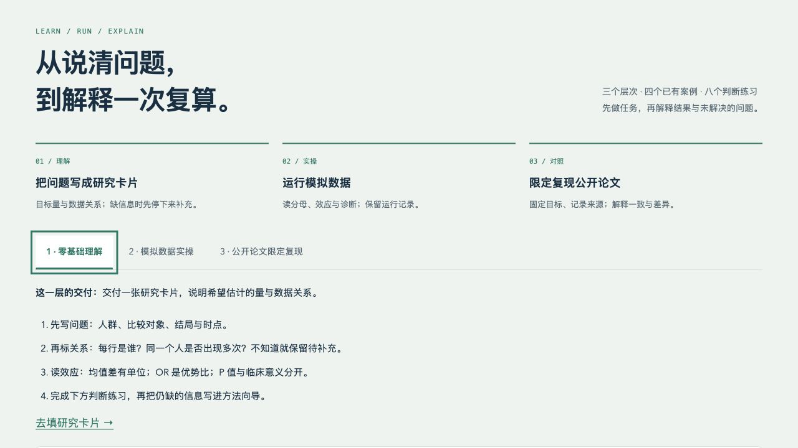
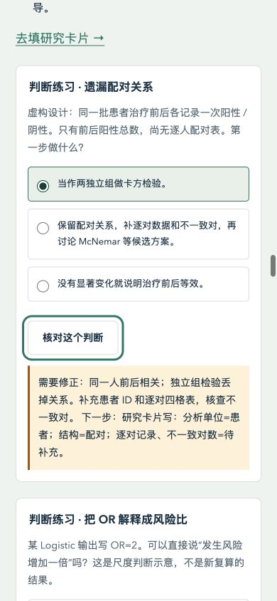

# 教学与诊断验收 v2.2 · 第 5 步

2026-10-09，本地版本 `2.2.0-dev.5`。本步完成教学组织与功能核查；没有进行 GitHub 发布 / 合并。第 2–4 步未提交成果继续保留。

## 改了什么，为什么

增加三层路径：理解问题 → 模拟实操 → 公开论文限定复现。四个核心案例是已有 24 例独立模拟、96 例含缺失模拟、2019 NHANES 和 medplot 重复访视。每个案例包含问题、目标量、方法理由、运行步骤、诊断解释、结果解读、常见错误与逐选项练习反馈。没有为了扩章节新增未验证的统计计算；另两篇论文仍保留材料 / 方法案例状态。

课程与 Markdown 从[共同课程源](教学课程v2.2.js)组织，统计数字读取原有统一 / 纵向视图，不改变结果。解释区分“已做 / 意义 / 待查”：收敛不证明模型适用或缺失机制；正态性与单因素 P 值不自动决定方法和调整集。

八个练习训练配对、OR / RR、等效、正态性、分母、协变量、抽样设计和重复访视判断。空答保留待选择，修改选择使旧反馈失效；每个干扰选项说明原因与需要补充的信息。不计算“学习效果”或 AI 正确率。

课程顺序参考林協霆 [learn-r-with-ai](https://github.com/htlin222/learn-r-with-ai/tree/5d0ac23bf48f6e0666b1681bc55532e6f69fd295) 的任务 / 运行 / 解释组织；已核查该提交的 MIT 许可、署名与版权。未复制其源码、教材原文或数据，保留参考链接；论文与作者代码的各自许可不变。

## 实际执行的检查

| 检查 | 实际结果 | 证据边界 |
|---|---|---|
| 教学规则 | 新增 12 个 Node 案例：可达路径、四案例八要素、八种判断、未知输入及共同来源；全部通过 | 原创规则回归测试，不是 AI 盲测 |
| 报告契约 | 新增 7 个 Python 案例：数值 / 哈希篡改、假执行、缺字段 / 非有限值、HTML 同源、快查不调用 R、build 链接 | 核对保存对象与失败边界；本套本身不重算 |
| 全套离线 | 74 个 Node + 24 个 Python（10 统一 / 7 纵向 / 7 报告）通过；课程伴随文档、来源、图表、原文目标、命名与本地链接核对通过 | 不下载公共个体数据、不重新拟合模型；远程 CI 未执行 |
| 无缓存副本 | 只复制项目非忽略文件，不带 build / 包缓存；全套测试通过，标准库 `python3 -S` 报告快查和本地链接检查通过 | 同主机的新文件副本，不是新 OS / 容器或包环境恢复 |
| 24 例计算报告 | 实际调用基础 R，10 个数值与冻结参考、4 个网页字段一致；生成独立自包含 HTML 和运行记录 | 仅当前模拟案例；不是 Quarto 环境或新跨系统恢复验证 |
| 96 例模拟核对 | 实际执行既有 7 项测试，Python 与基础 R 重新计算 76 个数值，一致 | 本步没有重拟合公共论文；也未重画旧 Q–Q / CRP 图 |
| 浏览器教学交互 | 八种题目的错误 / 正确反馈、空答、改答失效；层次切换、案例展开、可见统计结果检查通过 | 一个 Codex IAB 引擎；没有真人参与 |
| 浏览器原有交互 | 配对预设、生成提问、重置 / 未知信息、输入变更失效、软件 / 报告标签、旧解析展开与勾选记录可操作 | 提问为本地文本，未发给 AI；不宣称统计专家审核 |
| 中文 / 键盘 | 中文图文实际可读；方向键、Home / End 切换；Enter / Space 展开；原生单选方向键及提交；Table 1 方向键横向滚动实际从 0 到 40 px | 未测试屏幕阅读器、所有 OS / 浏览器或辅助技术 |
| 窄屏 | 实际 390×844：题目、单选、反馈与长命令可读；320×740：纵向卡片展开，页面宽度无横向溢出；临时视口已恢复 | 宽表格在自己的容器横向滚动；图的详细数字同时用正文解释，不宣称实体手机试用 |
| 控制台 | 记录时两个测试标签的 error / warn 列表为空 | 仅本次操作范围与采样时点 |
| 下载 | 按钮生成了可复制的完整研究卡片备用文本 | 10 秒内未观察到浏览器 download 完成事件；**文件保存未核实**，不写成下载验收通过 |

浏览器[逐项记录](assets/教学浏览器记录v2.2.json)保存真实反馈与显示数字。初始两次自动教学断言发现检查器问题（人为字数阈值、同义措辞），改为具体概念检查；显示核对按字段比较，避免 JSON 键顺序误报。没有更改任何统计期望值。计算报告初版 build 链接指向错误位置，已分开生成 build / docs 相对链接，修复后实际再次用 R 计算并导出。

无缓存副本首次运行还发现既有统一结果测试依赖 `build/` 预先存在；已在 `npm test` 入口创建空工作目录后重新通过，没有修改原测试期望或分析源码。完整 `npm run replay:teaching-report` 入口也实际执行成功，默认只写 build。





## 如何复查

在项目根目录执行：

```sh
# 快照 / 规则 / 链接 / 命名；不重新计算
npm run check:offline

# 实际小型 R 计算；默认只输出 build，不改变网页或冻结结果
npm run replay:teaching-report

# 96 例实际 R / Python 核对；需要此前恢复的 Python 计算环境
build/Python恢复环境v2.2/bin/python tests/clinical-reportv2.0.py
```

独立[报告](计算报告示范v2.2.html)与[该次运行记录](assets/计算报告记录v2.2.json)保存输入 / 代码 SHA-256，R 4.5.2 / stats 4.5.2、BLAS、Python 3.12.4 与 macOS 信息。`run --export` 是维护者显式导出动作；网页与 `check` 只读保存产物。完整 targets / renv 和两篇限定论文的实际证据仍见此前记录，本轮没有把它们重新记作新执行。

## 保护与仍有限制

原冻结数据 / 目标、作者提交、软件差异、统一三案例和纵向结果资产逐字节保留。新增课程只读这些来源。工程测试与数值核对、方法学评价、AI 测评及真人试用分别记录。

本步新增 13 个版本化文件；既有文件只改 README、index、styles、package、CI 和本轮验证记录。第 5 步起点 126 个非忽略文件中其余 120 个不变。10 个原冻结 data 文件仍与 HEAD 逐字节一致，纵向目标 SHA-256 仍为 `8864d5d321271b669027d170cae15a2c2d8c14552a7ab4086eae931dc57a5563`；本地 HEAD 与实际远程默认分支也未变。

没有真人学习效果证据，也没有可宣称的初学者易用性通过。残差与随机效应 / 缺失机制的充分评价、完整论文与全部 SI 重跑、独立方法学审查、AI 测评及真实初学者任务测试仍待后续指定步骤。正式分析需要完整方案与研究团队核查，本教学演示不提供临床疗效结论。
