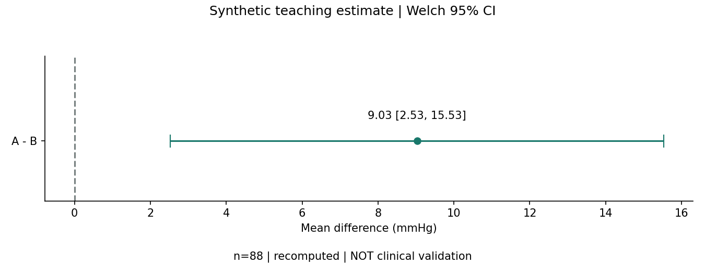
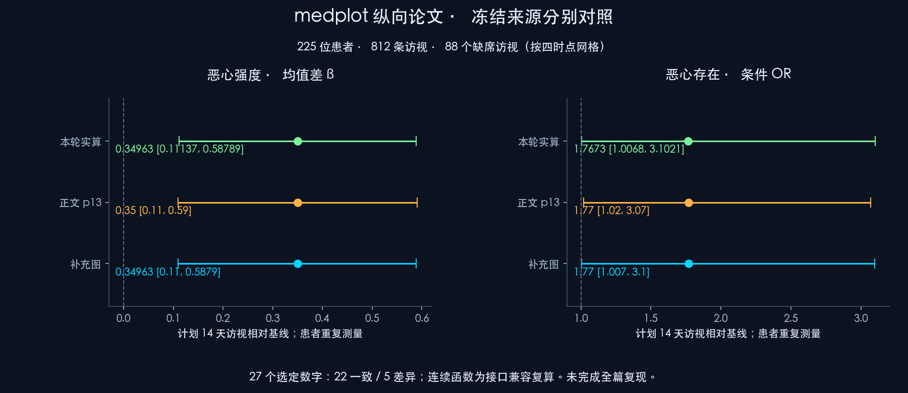
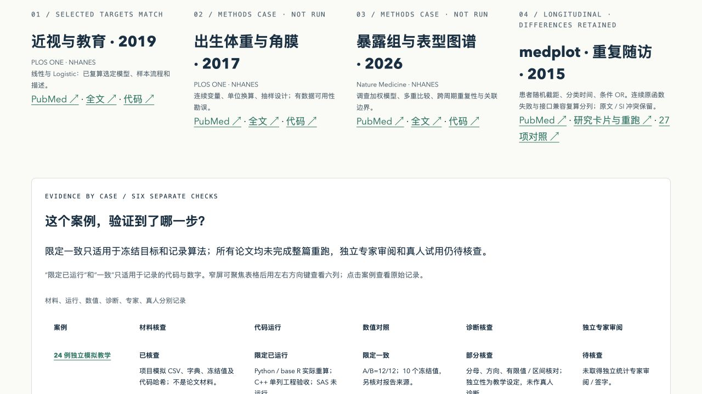
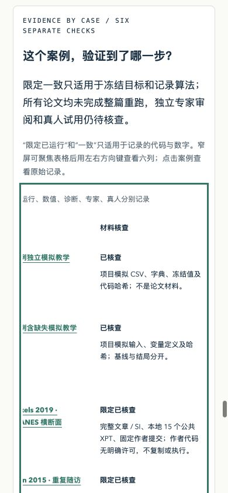

<p align="center"></p>

<h1 align="center">医学科研统计选择指南 · Clinical Statistics Guide</h1>

<p align="center"><strong>Explain method choices, reproduce results, and identify what still needs checking.</strong><br>说明选择依据，复算结果，识别待核查信息。</p>

<p align="center">Illustrated, offline teaching and analysis-plan drafts for clinical researchers with no programming background.</p>

<p align="center"><a href="README.md">简体中文</a> · <a href="英文首页v2.3.md">English</a></p>

<p align="center"><a href="https://github.com/TUANZIDING/clinical-stats-languages-guide/actions/workflows/checks.yml"></a> <a href="LICENSE"></a></p>

<p align="center"><code>Chinese offline website</code> · <code>Synthetic practice</code> · <code>Limited paper reproduction</code> · <code>Offline AI assertions</code></p>

<p align="center"><a href="#use-cases">Use cases</a> ｜ <a href="#showcase">Showcase</a> ｜ <a href="#quick-start">Quick start</a> ｜ <a href="#capabilities">Capability status</a> ｜ <a href="#contribute">Documentation</a></p>

<p align="center"><sub>The cover is an original concept illustration, not a screenshot or validation evidence. Current version: 2.3.0. See the <a href="发布记录v2.3.md">closeout and publication record</a> for release evidence.</sub></p>

---

<a id="use-cases"></a>

## Start with your research question

You do not need to become a programmer first. You do need to identify the population, comparison, outcome, meaning of each row, and estimand. This project supports a draft for discussion; formal research still requires the complete protocol, data-quality checks and statistical expertise.

| What you want to do | Where to start |
|---|---|
| Choose a statistical method | [Chinese method navigator](https://tuanziding.github.io/clinical-stats-languages-guide/#navigator) and [research card](docs/研究卡片说明v2.2.md); unknown information stays pending |
| Compare SAS, R, Python, C++ and menu-based tools | [Tool guide](docs/software-guide.md) and [four-language examples](examples/README.md) |
| Interpret mean differences, CIs, Table 1 and missingness | [Three-level learning path with eight exercises](docs/教学路径v2.2.md) and [clinical practice](docs/临床统计实操v2.0.md) |
| Check calculations against published studies | [NHANES case](docs/论文验证v2.1.md) and [medplot repeated follow-up](docs/纵向论文验证v2.2.md) |
| Ask AI for help and inspect its answer | [AI workflow](docs/ai-workflow.md) and [v2.3 offline evaluation framework](docs/AI测评框架v2.3.md) |

Choose software to fit the task and team: jamovi or an already licensed SPSS installation can offer a menu-based start; R supports statistical analysis and reproducibility; Python supports automation, imaging and machine learning; SAS helps follow team procedures; C++ generally supports algorithm development. These are teaching suggestions, not measured usability rankings. Lines of code do not establish correctness, and C++ can calculate P values using mathematical libraries. [Official sources and scope](docs/sources.md)

<a id="showcase"></a>

## Results with their limits

| Synthetic clinical teaching | Limited reproduction of published repeated follow-up |
|---|---|
| [](docs/临床统计实操v2.0.md) | [](docs/纵向论文对照v2.2.md) |
| A/B: 48 each; observed outcomes: 45/43; A−B = 9.03 mmHg, 95% CI [2.53, 15.53]. Deliberately constructed data, with no treatment-efficacy claim. | 225 patients, 812 visits, 88 absent visits. Of 27 frozen comparisons, 22 match and 5 differ. This is not whole-paper reproduction. |

Tables, captions and result text use a [shared result object](docs/结果对象与复现v2.2.md). In NHANES 2019, 72 selected targets match within the original algorithm and rounding rules. Only 16/32 current default t-interval endpoints match; the other 16 remain recorded. [Numerical comparisons and software differences](docs/论文验证v2.1.md)

<a id="quick-start"></a>

## Quick start

After downloading the repository, open [docs/index.html](docs/index.html) for offline browsing. Local HTTP is recommended for the core interactions; the complete `file://` workflow has not been tested:

```sh
python3 -m http.server 8765 --directory docs
```

Open `http://localhost:8765`; choose another unused port if necessary. The [published Chinese website](https://tuanziding.github.io/clinical-stats-languages-guide/) is also available. Start with the learning path, complete the basic research card, expand advanced fields as needed, and inspect candidates and missing information.

Website browsing requires no statistical dependencies. There are no uploads, AI APIs, tracking scripts or external fonts. “Generate a prompt” produces text for manual copying. This English homepage fully describes the project; the interactive website and most tutorials remain Chinese. Research descriptions can still contain sensitive information: follow institutional requirements before sending them to an external AI service.

| Desktop learning interface | Narrow-screen learning interface |
|---|---|
|  |  |

<sub>These are genuine historical screenshots from local v2.2 functional checks. They do not replace the current online visual inspection or demonstrate learning effectiveness.</sub>

<a id="workflow"></a>

## From a method rationale to a reproducible record

**Question and estimand → Design and analysis unit → Conditions and gaps → Prespecified analysis → Recalculation and diagnostics → Reporting with limits**


| Task | Support and boundary |
|---|---|
| Describe the design | The research card records pairing, repetition, clustering, survey sampling, counts, time, missingness and adjustment rationale; multiple conditional candidates are allowed |
| Choose and interpret | Do not switch methods solely on normality P values or choose covariates solely on univariate P values; report effects and CIs and distinguish OR, RR and HR |
| Learn and practice | Beginner understanding → synthetic practice → limited public-paper reproduction; feedback covers omitted pairing or weights and misinterpreted nonsignificance |
| Inspect AI answers | Ten tuning and eight holdout contexts are separated by research groups; citations, calculations, serious errors and human review are recorded separately; the holdout set is publicly visible |
| Reproduce and report | One result object supplies tables, figures and text; quick checks inspect saved snapshots, while recalculation has separate entry points |

<a id="capabilities"></a>

## Capability status

| Evidence layer | Available work | Still to check |
|---|---|---|
| Engineering | Local tests, offline contracts, links, filenames and CI; current results in the [publication record](发布记录v2.3.md) | Passing engineering checks does not establish scientific validity |
| Numerical reproduction | Two synthetic examples and selected analyses from two public papers; frozen values, denominators, direction, hashes, author versions and differences retained | No whole-paper reruns; birth-weight and exposome models have not run |
| Methodology | Design, estimands, missingness and partial diagnostics are documented | Complete diagnostics, missing-data sensitivity and model adequacy remain pending |
| AI evaluation | Eighteen contexts, multiple conditional references, offline assertions, paired output comparison and Promptfoo fixed-output compatibility | All 18 reference answers await statistician review; no actual model calls or AI accuracy estimate |
| Independent expert / human use | Review templates and eight judgment exercises | No independent statistical sign-off or human learner trial; AI-assisted review is not expert review |
| Interface and publication | Chinese static website and existing manual Pages workflow | Remote files, page accessibility and browser visuals are reported separately |

The [six-axis case status table](docs/案例验证状态v2.2.md) separates materials, execution, numerical comparison, diagnostics, expert review and human use. The v2.3 engineering framework does not promote these scientific statuses.

<details>
<summary><strong>Checks, environments and actual recalculation</strong></summary>

The complete offline check uses Node ≥18, Python 3.12 and `requirements.txt`. Website browsing does not require these dependencies.

```sh
python3 -m pip install -r requirements.txt
npm run check:offline
npm run eval:offline
```

`check:offline` checks saved objects, hashes and artifacts; it **does not fit models**. `eval:offline` checks seven developer-authored fixed outputs from three research contexts: three satisfy the contract and four deliberate errors are detected. These are not model outputs or AI accuracy. Optional Promptfoo 0.124.1 requires Node ≥22.22.0 and internet access for initial installation; the [native offline instructions](docs/AI测评框架v2.3.md) distinguish expected assertion failures from execution errors.

Limited full recalculation additionally requires R 4.5.2 and locked packages: [custom targets / renv paths](docs/结果对象与复现v2.2.md), `npm run replay:longitudinal`, and `npm run replay:teaching-report`. Fresh isolated libraries on the same macOS host were tested previously; this is not cross-OS restoration or recreation of an author's historical environment. [Small computable report](docs/计算报告示范v2.2.html)

There is no frontend `npm build` entry point. The existing Pages workflow manually publishes `docs/`; ordinary pushes do not deploy. [Publishing workflow](docs/publishing.md)

</details>

<a id="contribute"></a>

## Documentation, review and contributions

Linked detailed tutorials currently use Chinese; this homepage supplies the complete English overview, setup and capability boundaries.

| Topic | Entry points |
|---|---|
| Basic methods, tools and examples | [Methods](docs/method-guide.md) · [Tools](docs/software-guide.md) · [Examples](examples/README.md) · [Worked example](docs/worked-example.md) |
| Cards, provenance and reproducibility | [Research card](docs/研究卡片说明v2.2.md) · [Shared results](docs/结果对象与复现v2.2.md) · [Reporting checklist](docs/统计报告核对v2.0.md) |
| Learning and AI | [Learning path](docs/教学路径v2.2.md) · [AI workflow](docs/ai-workflow.md) · [Evaluation framework](docs/AI测评框架v2.3.md) |
| Templates | [Analysis plan](templates/analysis-plan.md) · [AI prompt](templates/ai-statistics-prompt.md) · [Evaluation prompt](templates/AI测评提示词v2.3.md) · [Statistician review](templates/统计人员审阅v2.3.md) |
| Papers, licenses and sources | [Paper validation](docs/论文验证v2.1.md) · [Longitudinal selection and licenses](docs/纵向论文候选v2.2.md) · [Related open-source projects](docs/相关项目导航v2.0.md) · [Sources](docs/sources.md) |
| Acceptance and publication | [Current closeout](发布记录v2.3.md) · [Local v2.3 history](验证记录v2.3.md) · [v2.2 history](验证记录v2.2.md) · [v2.0](验证记录v2.0.md) · [v1](VALIDATION.md) |
| Chinese / feedback | [Chinese homepage](README.md) · [GitHub Issues](https://github.com/TUANZIDING/clinical-stats-languages-guide/issues) |

Contributions should identify the design context, traceable sources and reasons for statistical judgments. Newly chosen filenames use a natural name, version and extension without underscores; legacy names remain. Historical “not executed” or “not published” records are not backfilled, and the layer that passed must be specified.

---

<p align="center"><strong>医学科研统计选择指南 · Clinical Statistics Guide</strong><br><a href="https://github.com/TUANZIDING">TUANZIDING</a> · <a href="LICENSE">MIT</a> · <a href="docs/sources.md">Sources and scope</a></p>

Original project code, text and figures use MIT. Third-party tools and materials retain their own licenses and attribution. Raw articles, supplements, individual-level public data, author code, dependency caches, credentials and runtime logs are excluded from this public release. The project has not scanned or analyzed the user's private patient data or unpublished research.
